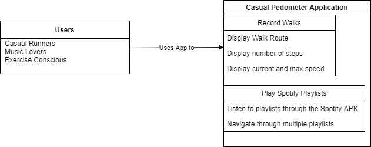

# Casual Pedometer

## Project Abstract

This project is an Android phone application that records the user's movements to help them with walking exercise. The application will record how long a walk takes,
how many steps the user walked, how many calories they burned on their walk and record their route. In addition, this app will allow for Spotify playlist integration and 
playback inside the application itself, allowing the app to also function as a music player.

## Project Relevance
This project will involve using Github to track the evolution of this app from a simple GPS tracker to a fully-featued useful application. I will need to test 
the functionality using Android Studio and build on top of the work already given by the original code. In order to communicate both the walking and music playiing features to the user, I will also need to develop a well-designed GUI. 

## Conceptual Design
This project will use the GPS tracking feature as a base for the pedometer section. As for the contributions, the addition of Spotify integration is a unique feature that I have not seen before and is of personal interest to me. I know how to test, run and publish Android applications, which will allow me to create a useful app with this project.
My contribution to this project is to add the functinality described above for the exercise portion. Additionally, I will personally create the Spotify integration by using
the beta Spotify SDK. Finally, I will change the UI from only displaying a GPS map with Location Updates to also include the music playlist and controls on the screen;
the map will be called by the user manually, instead of always being present. 

The project will be using the GPSWithMaps application found here on Github as a base. 
https://github.com/karlmorris/GPSWithMaps

This project can be found here:
https://github.com/tuh04152/Casual-Pedometer/

## Running the Project
To run and test this project, one will need *Android Studio* with an emulated Android device of SDK 29 or later. The project will be written with a main activity that opens into multiple fragments. These fragments will allow display the information to the user and allow them to interact with the application. The app will be run from inside Android Studio and can be packaged into an .apk file for distribution. 
